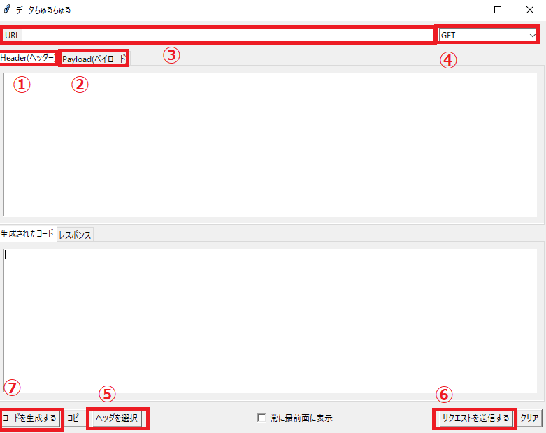

# データちゅるちゅる
requestモジュールを使ったスクレイピングのスクレイピング補助ソフト。  
headerとPayloadをコピペするだけで簡単にリクエストを送るコードが書けます。

## 注意
ブラウザはGoogle Chromeを使用してください。  
Microsoft EdgeやFireFoxは今後対応していく予定です。

## 使用方法
1. data_extractionをダウンロードし解凍してください。
2. data_extractionフォルダ内のdata_extraction.exeを実行してください。
3. Chromeでスクレイピング対象サイトを開発者ツールで開き、ネットワークタブから送りたいリクエストのheaderとpayloadをコピーし、データちゅるちゅるに貼り付けて下さい。
4. リクエストを送る先のURLとリクエスト方法(get/post/put)を選択してください。
5. ヘッダを選択ボタンを押して含めたいヘッダー要素にチェックボックスを入れて下さい。
6. リクエストを送信するボタンを押し、正常にリクエスト送信できるかを確認してください。
7. コードを生成するボタンを押し、コードを生成してください。  

以上になります。

